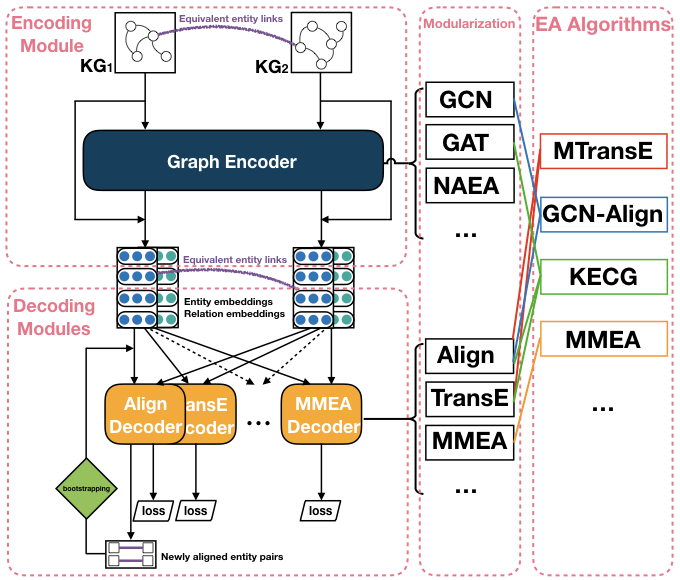
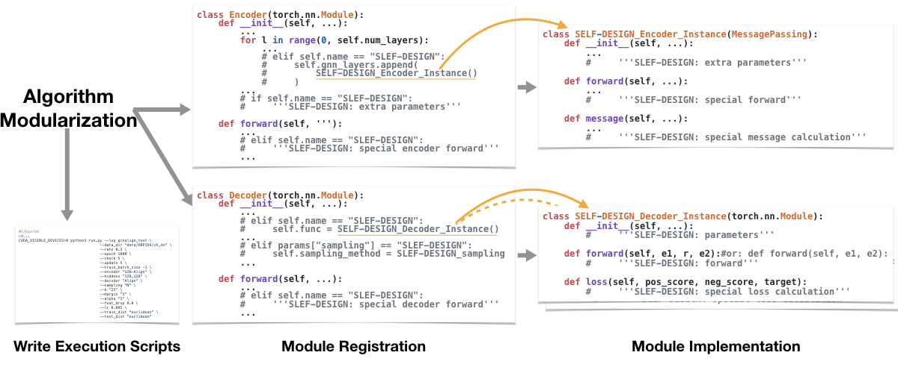

# EAkit
*Entity Alignment toolkit* (EAkit), a lightweight, easy-to-use and highly extensible PyTorch implementation of many entity alignment algorithms. The algorithm list is from [Entity_Alignment_Papers](https://github.com/THU-KEG/Entity_Alignment_Papers).

**Table of Contents**
1. [Design](#Design)
2. [Organization](#Organization)
3. [Usage](#Usage)
    1. [Run an implemented model](#Run-an-implemented-model)
        1. [Semantic Matching Models](#Semantic-Matching-Models)
        2. [GNN-based Models](#GNN-based-Models)
        3. [KE-based Models](#KE-based-Models)
        4. [Results](#Results)
    2. [Write a new model](#Write-a-new-model)
4. [Dataset](#Dataset)
5. [Reqirements](#Reqirements)
6. [TODO](#TODO)
7. [Acknowledgement](#Acknowledgement)


## Design
We sort out the existing entity alignment algorithms and modularizing the composition of them, and then define an abstract structure as **1 Encoder - N Decoder(s)**, where different modules are regarded as specific implementations of different encoders and decoders, so as to restore the structures of the algorithms.




## Organization
```
./EAkit
├── README.md                           # Doc of EAkit
├── _runs                               # Tensorboard log dir
├── data                                # Datasets. (unzip data.zip)
│   └── DBP15K
├── examples                            # Shell scripts of implemented algorithms
│   ├── Tensorboard.sh                  # Start Tensorboard visualization
│   ├── run_BootEA.sh
│   ├── run_ComplEx.sh
│   ├── run_ConvE.sh
│   ├── run_DistMult.sh
│   ├── run_GCN-Align.sh
│   ├── run_HAKE.sh
│   ├── run_KECG.sh
│   ├── run_MMEA.sh
│   ├── run_MTransE.sh
│   ├── run_NAEA.sh
│   ├── run_RotatE.sh
│   ├── run_TransE.sh
│   ├── run_TransEdge.sh
│   ├── run_TransH.sh
│   └── run_TransR.sh
├── load_data.py                        # Load datasets. (data adapter)
├── models.py                           # Encoders & Decoders
├── run.py                              # Main
├── semi_utils.py                       # Bootstrap strategy
└── utils.py                            # Sampling methods, ...
```


## Usage

### Run an implemented model

1. Start TensorBoard for metrics visualization (run under `examples/`):
```
./Tensorboard.sh
```

2. Modify and run a script as follow (examples are under `examples/`):
```
CUDA_VISIBLE_DEVICES=0 python3 run.py --log gcnalign \
                                    --data_dir "data/DBP15K/zh_en" \
                                    --rate 0.3 \
                                    --epoch 1000 \
                                    --check 10 \
                                    --update 10 \
                                    --train_batch_size -1 \
                                    --encoder "GCN-Align" \
                                    --hiddens "100,100,100" \
                                    --decoder "Align" \
                                    --sampling "N" \
                                    --k "25" \
                                    --margin "1" \
                                    --alpha "1" \
                                    --feat_drop 0.0 \
                                    --lr 0.005 \
                                    --train_dist "euclidean" \
                                    --test_dist "euclidean"
```

In detail, the following methods are currently implemented:


#### Semantic Matching Models

| Method |  | Encoder | Decoder |
| ---- | ---- | ---- | ---- |
| **[MTransE](https://www.ijcai.org/proceedings/2017/0209.pdf)** from Chen *et al.* (IJCAI 2017) | \[[sh](https://github.com/THU-KEG/EAkit/blob/master/examples/run_MTransE.sh)\], \[[origin](https://github.com/muhaochen/MTransE)\] | None | TransE, MTransE_Align |
| **[BootEA](https://www.ijcai.org/proceedings/2018/0611.pdf)** from Sun *et al.* (IJCAI 2018) | \[[sh](https://github.com/THU-KEG/EAkit/blob/master/examples/run_BootEA.sh)\], \[[origin](https://github.com/nju-websoft/BootEA)\] | None | AlignEA |
| **[TransEdge](https://link.springer.com/chapter/10.1007/978-3-030-30793-6_35)** from Sun *et al.* (ISWC 2019) | \[[sh](https://github.com/THU-KEG/EAkit/blob/master/examples/run_TransEdge.sh)\], \[[origin](https://github.com/nju-websoft/TransEdge)\] | None | TransEdge |
| **[MMEA](https://www.aclweb.org/anthology/D19-1075.pdf)** from Shi *et al.* (EMNLP 2019) | \[[sh](https://github.com/THU-KEG/EAkit/blob/master/examples/run_MMEA.sh)\], [origin] | None | MMEA |


#### GNN-based Models

| Method |  | Encoder | Decoder |
| ---- | ---- | ---- | ---- |
| **[GCN-Align](https://www.aclweb.org/anthology/D18-1032.pdf)** from Wang *et al.* (EMNLP 2018)  | \[[sh](https://github.com/THU-KEG/EAkit/blob/master/examples/run_GCN-Align.sh)\], \[[origin](https://github.com/1049451037/GCN-Align)\] | GCN-Align | Align |
| **[NAEA](https://www.ijcai.org/proceedings/2019/0269.pdf)** from Zhu *et al.* (IJCAI 2019) | \[[sh](https://github.com/THU-KEG/EAkit/blob/master/examples/run_NAEA.sh)\], [origin] | NAEA | \[N_TransE\], N_TransE, N_R_Align |
| **[KECG](https://www.aclweb.org/anthology/D19-1274.pdf)** from Li *et al.* (EMNLP 2019) | \[[sh](https://github.com/THU-KEG/EAkit/blob/master/examples/run_KECG.sh)\], \[[origin](https://github.com/THU-KEG/KECG)\] | KECG | TransE, Align |


#### KE-based Models

| Method |  | Encoder | Decoder |
| ---- | ---- | ---- | ---- |
| **[TransE](https://www.aaai.org/ocs/index.php/AAAI/AAAI15/paper/viewFile/9571/9523)** from Bordes *et al.* (NIPS 2013) | \[[sh](https://github.com/THU-KEG/EAkit/blob/master/examples/run_TransE.sh)\],  | None | TransE |
| **[TransH](https://www.aaai.org/ocs/index.php/AAAI/AAAI14/paper/view/8531/8546)** from Wang *et al.* (AAAI 2014) | \[[sh](https://github.com/THU-KEG/EAkit/blob/master/examples/run_TransH.sh)\],  | None | TransH |
| **[TransR](https://www.aaai.org/ocs/index.php/AAAI/AAAI15/paper/viewFile/9571/9523)** from Lin *et al.* (AAAI 2015) | \[[sh](https://github.com/THU-KEG/EAkit/blob/master/examples/run_TransR.sh)\],  | None | TransR |
| **[RotatE](https://openreview.net/pdf?id=HkgEQnRqYQ)** from Sun *et al.* (ICLR 2019) | \[[sh](https://github.com/THU-KEG/EAkit/blob/master/examples/run_RotatE.sh)\],  | None | RotatE |
| **[HAKE](https://arxiv.org/pdf/1911.09419)** from Zhang *et al.* (AAAI 2020) | \[[sh](https://github.com/THU-KEG/EAkit/blob/master/examples/run_HAKE.sh)\],  | None | HAKE |
| **[DistMult](https://arxiv.org/pdf/1412.6575)** from Yang *et al.* (ICLR 2015) | \[[sh](https://github.com/THU-KEG/EAkit/blob/master/examples/run_DistMult.sh)\],  | None | DistMult |
| **[ComplEx](http://proceedings.mlr.press/v48/trouillon16.pdf)** from Trouillon *et al.* (ICML 2016) | \[[sh](https://github.com/THU-KEG/EAkit/blob/master/examples/run_ComplEx.sh)\],  | None | ComplEx |
| **[ConvE](https://arxiv.org/pdf/1707.01476)** from Dettmers *et al.* (AAAI 2018) | \[[sh](https://github.com/THU-KEG/EAkit/blob/master/examples/run_ConvE.sh)\],  | None | ConvE |


#### Results
Results on DBP15K(zh_en, ja_en, fr_en).

| | Hits@1 | Hits@10 | MRR | Hits@1 | Hits@10 | MRR | Hits@1 | Hits@10 | MRR |
|-|-|-|-|-|-|-|-|-|-|
| **MTransE** | 0.419 | 0.753 | 0.535 | 0.433 | 0.773 | 0.549 | 0.407 | 0.751 | 0.526 |
| **BootEA** | 0.490 | 0.793 | 0.593 | 0.499 | 0.813 | 0.605 | 0.515 | 0.838 | 0.623 |
| **TransEdge** | 0.519 | 0.813 | 0.621 | 0.526 | 0.825 | 0.632 | 0.397 | 0.824 | 0.543 |
| **MMEA** | 0.405 | 0.672 | 0.499 | 0.397 | 0.680 | 0.496 | 0.442 | 0.749 | 0.550 |
| **GCN-Align** | 0.410 | 0.756 | 0.527 | 0.442 | 0.810 | 0.566 | 0.430 | 0.813 | 0.557 |
| **NAEA** | 0.323 | 0.481 | 0.381 | 0.311 | 0.457 | 0.363 | 0.307 | 0.460 | 0.362 |
| **KECG** | 0.467 | 0.815 | 0.586 | 0.485 | 0.843 | 0.605 | 0.479 | 0.844 | 0.602 |
| **TransE** | 0.343 | 0.634 | 0.441 | 0.365 | 0.710 | 0.480 | 0.374 | 0.735 | 0.493 |
| **TransH** | 0.436 | 0.735 | 0.540 | 0.450 | 0.778 | 0.561 | 0.485 | 0.821 | 0.599 |
| **TransR** | 0.371 | 0.697 | 0.481 | 0.368 | 0.709 | 0.484 | 0.378 | 0.741 | 0.497 |
| **RotatE** | 0.423 | 0.754 | 0.534 | 0.448 | 0.785 | 0.561 | 0.439 | 0.800 | 0.560 |
| **HAKE** | 0.288 | 0.588 | 0.391 | 0.319 | 0.607 | 0.421 | 0.319 | 0.638 | 0.428 |
| **DistMult** | 0.180 | 0.400 | 0.255 | 0.058 | 0.179 | 0.099 | 0.095 | 0.285 | 0.157 |
| **ComplEx** | 0.115 | 0.265 | 0.166 | 0.063 | 0.251 | 0.146 | 0.141 | 0.332 | 0.206 |
| **ConvE** | 0.210 | 0.466 | 0.299 | 0.339 | 0.556 | 0.415 | 0.350 | 0.602 | 0.439 |


### Write a new model
1. Divide the algorithm at the abstract level to obtain the structure of 1 (or 0) Encoder and 1 (or more) Decoder(s).
2. Register the modules and add extra parameters in the top-level encoder (class Encoder) and top-level decoder (class Decoder) in `models.py`.
3. Implement the concrete encoding module (class Encoder_Instance) and decoding module(s) (class Decoder_Instance) according to the given template.
4. Write an execution script (XXX.sh) with parameter settings to run the new model.
5. (Adapt a new dataset in `load_data.py`, and add a new sampling strategy in `utils.py`.)




## Dataset
(Currently, EAkit only supports DBP15K, but it is easy to adapt to other datasets.)

- **DBP15K** is from the "mapping" folder of [JAPE](https://github.com/nju-websoft/JAPE)(But need to combine "ref_ent_ids" and "sup_ent_ids" into a single file named "ill_ent_ids")

Here, you can directly unpack the data file after [downloading](https://1drv.ms/u/s!AmQC2vZKsxjzhyCstNUSt2QVQgzi?e=WRE0cA):
```
unzip data.zip
```


## Reqirements
- Python3 (tested on 3.7.7)
- [PyTorch](https://pytorch.org/) (tested on 1.4.0)
- PyTorch Geometric ([PyG](https://github.com/rusty1s/pytorch_geometric)) (tested on 1.4.3)
- [TensorBoard](https://www.tensorflow.org/tensorboard/) (tested on 2.0.2)
- Numpy
- Scipy
- Scikit-learn
- [Graph-tool](https://git.skewed.de/count0/graph-tool/wikis/installation-instructions) (if use bootstrapping)


## TODO
- [ ] Results of BootEA, TransEdge, MMEA, NAEA are not satisfactory, they need debug (maybe on the bootstrapping process).

There are still many algorithms that need to be implemented (integrated):
- **Semantic Matching Models**: NTAM, AttrE, CEAFF, ...
- **GNN-based Models**: AVR-GCN, AliNet, MRAEA, CG-MuAlign, RDGCN, HGCN, GMNN, ...
- **KE-based Models**: TransD, CapsE, ...
- **GAN-based Models**: SEA, AKE, ...
- **Other Models**: OTEA, ...

Find algorithms from [Entity_Alignment_Papers](https://github.com/THU-KEG/Entity_Alignment_Papers).

[Pull requests](https://github.com/THU-KEG/EAkit/pulls) for **implementing algorithms** & **updating (reproducible) results with shell scripts** are welcome!


## Acknowledgement
We refer to some codes of the following repos, and we appreciate for their great contributions: [PyTorch Geometric](https://github.com/rusty1s/pytorch_geometric), [BootEA](https://github.com/nju-websoft/BootEA), [TransEdge](https://github.com/nju-websoft/TransEdge), [AliNet](https://github.com/nju-websoft/AliNet), [TuckER](https://github.com/ibalazevic/TuckER). If we miss some, do please let us know in [Issues](https://github.com/THU-KEG/EAkit/issues).

This project is mainly contributed by [Chengjiang Li](https://github.com/iamlockelightning), [Lei Hou](https://github.com/HLGreener), [Juanzi Li](http://keg.cs.tsinghua.edu.cn/persons/ljz/).
